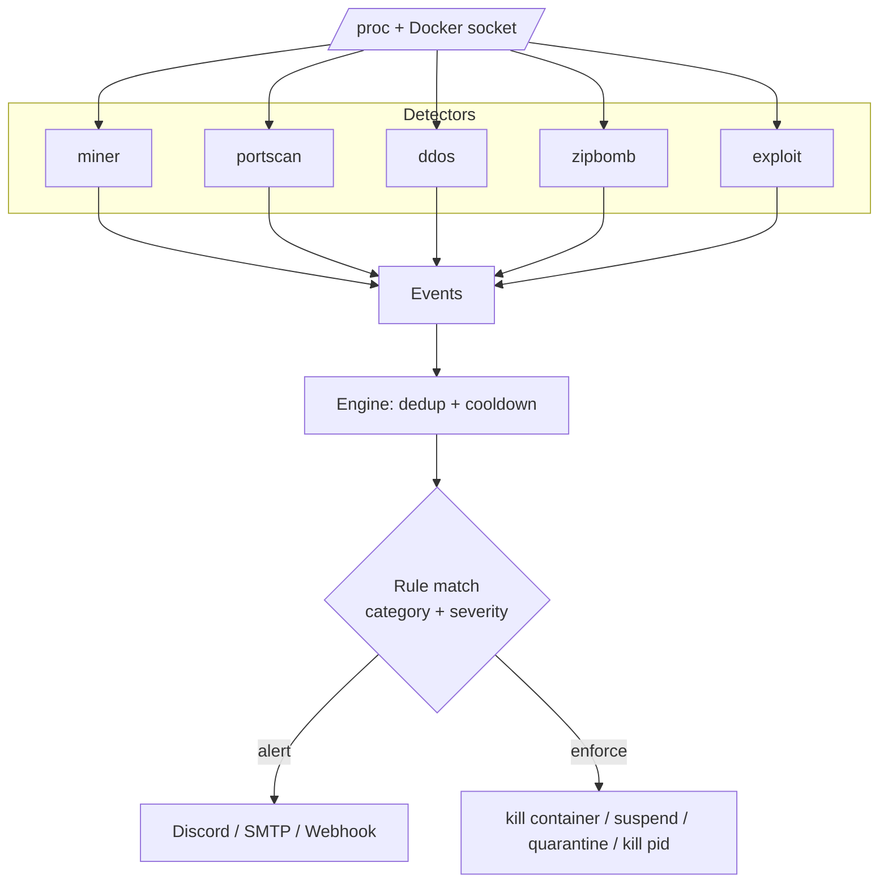

<div align="center">

# 🛡️ protection

### Kernel-level abuse protection for container hosts

**One static Go binary that guards Pterodactyl/Wings nodes, Docker hosts and bare VPS boxes against miners, DDoS tools, port scans, zip bombs and exploits — then alerts and shuts them down automatically.**

[](https://github.com/AnAverageBeing/protection/releases)
[](https://github.com/AnAverageBeing/protection/actions)
[](https://goreportcard.com/report/github.com/AnAverageBeing/protection)
[](LICENSE)

-555)

</div>

---

## ⚡ Install (one line)

```bash
curl -fsSL https://raw.githubusercontent.com/AnAverageBeing/protection/main/install.sh | sudo bash
```

The installer downloads the prebuilt static binary for your architecture and
then **asks a few quick questions** — what to name this installation, what to
protect (server / docker / both), your Discord webhook, and whether to use
Pterodactyl auto-suspend. Everything else has a sane default you can tune later
in the config. It writes the config **in safe dry-run mode** and enables the
service. No Go toolchain, no dependencies.

```text
? Name this installation [node-fra-01]:
? Protect what? (server / docker / both) [both]:
? Discord webhook URL for alerts (blank to skip):
? Using Pterodactyl? auto-suspend abusive servers (y/N): y
? Arm enforcement now? 'no' keeps safe dry-run mode (y/N): N
```

Then:

```bash
sudo nano /etc/protection/config.yaml   # add your Discord webhook / email
protection test-alert                   # confirm alerts work
journalctl -u protection -f             # watch what it WOULD do
# happy? set dry_run: false, then: sudo systemctl restart protection
```

---

## 📑 Table of contents

- [What it protects against](#-what-it-protects-against)
- [Why it's different](#-why-its-different)
- [How detection works](#-how-detection-works)
- [Alerts](#-alerts)
- [Actions & rules](#-actions--rules)
- [Commands](#-commands)
- [Configuration](#-configuration)
- [How it all fits together](#-how-it-all-fits-together)
- [Permissions & hardening](#-permissions--hardening)
- [Build from source](#-build-from-source)
- [Roadmap](#-roadmap)
- [FAQ](#-faq)

---

## 🚨 What it protects against

| Threat | What it catches |
|---|---|
| ⛏️ **Cryptocurrency miners** | Known miner binaries, miner argument fingerprints, sustained high CPU (even *unknown* miners), and connections to mining-pool ports |
| 🌊 **Outbound DDoS / stress tools** | Per-container egress flood rates, known tools (hping3, t50, mhddos, LOIC/HOIC…), `java -jar *ddos.jar` flooders, and connection-count floods |
| 🔭 **Port scans** | Half-open connection fan-out across many ports/hosts, plus scanner binaries (nmap, masscan, zmap, rustscan…) |
| 💣 **Decompression bombs** | zip / jar / gzip bombs detected from archive metadata **without extracting** — classic nested *and* modern overlapping/quine bombs |
| 🐚 **Exploits & container escapes** | Reverse shells, privilege escalation, `nsenter` namespace breakout, and setuid payloads dropped in world-writable dirs |

When a threat is confirmed, protection **alerts** (Discord / email / webhook) and
**enforces** (kill container, suspend the Pterodactyl server, quarantine the
file, kill the process) — driven by a simple, overridable rule set.

---

## 💎 Why it's different

- **Single static binary, zero cgo.** Drop it on any Linux node. The only build dependency is `gopkg.in/yaml.v3`.
- **No agents inside containers.** It runs on the host and watches all containers from outside, so clients can't see it, disable it, or evade it from inside their container.
- **Pterodactyl-native.** Maps offending containers and volume files back to the owning server UUID and can suspend the server through the Application API.
- **Works on bare VPS too.** The smart `neutralize` action kills the *container* for containerised threats and the *process* for host threats — one policy, every host type.
- **Fast & responsive.** One shared system snapshot per 5s tick (a single `/proc` walk for all detectors), parallel socket→PID resolution with a time budget so a noisy neighbour can never stall detection.
- **Event-driven, not just polled.** A spike in CPU + disk writes (an active extraction) instantly triggers a targeted zip-bomb check on that exact process — no waiting for the next sweep.
- **Safe by default.** Ships in `dry_run: true`: it detects and alerts but won't enforce until *you* arm it.
- **Tunable, not a black box.** Every threshold, signature list and enforcement rule lives in one documented YAML file.

### Modes

Set `general.mode` (or pick it in the installer) to scope what protection acts on:

| Mode | Scope |
|---|---|
| `server` | Host/VPS processes only (great for a plain VPS) |
| `docker` | Containerised threats only (Pterodactyl/Docker nodes) |
| `both` | Everything (default) |

| Capability | How it's done (pure Go) |
|---|---|
| Process inspection | `/proc/<pid>/{stat,cmdline,exe,status,cgroup}` |
| CPU usage | jiffy sampling across scan intervals |
| Network connections | `/proc/net/tcp{,6}` + socket-inode → PID via `/proc/<pid>/fd` |
| Container attribution | 64-hex container id from `/proc/<pid>/cgroup` |
| Container egress rates | Docker Engine API `stats` over the unix socket |
| Archive bombs | `archive/zip` central directory + gzip ISIZE trailer |

---

## 🔬 How detection works

### ⛏️ Miner
Three independent signals that escalate when combined:
1. **Signature** — `comm`/`exe`/`cmdline` matches a known miner (xmrig, t-rex, nbminer, …) or a miner fingerprint (`stratum+tcp`, `--donate-level`, `randomx`, …).
2. **Sustained CPU** — per-core CPU% from jiffy deltas must stay above `cpu_threshold` for `sustained_seconds` (catches custom/unknown miners).
3. **Pool connection** — an established connection to a known mining-pool port.

Signature **and** high CPU together ⇒ **critical**.

### 🌊 DDoS
- **Container egress rate** via Docker `stats` — flags pps/bps over threshold.
- **Tool signatures** — word-boundary matched so generic fragments never cause false positives.
- **Java flooders** — heuristics for `java -jar …(ddos|booter|stresser|flood).jar`.
- **Connection floods** — a single process holding thousands of outbound connections.

### 🔭 Port scan
Accumulates distinct destination ports/hosts per process from half-open
(`SYN_SENT`) connections over a sliding `window`; flags on thresholds or known
scanner binaries.

### 💣 Zip bomb
Reads **declared** sizes from archive metadata — never extracts — and flags
absurd compression ratios or uncompressed totals. Two ways:
- **Hot trigger (event-driven):** when a process spikes CPU *and* disk writes — the fingerprint of an active extraction — protection immediately inspects the archive(s) that process has open (via its `/proc/<pid>/fd`) plus its working directory. A bomb is caught mid-unzip in seconds, not after a fixed delay.
- **Full sweep (backstop):** a slow periodic walk (default 30m) of every scan path catches bombs uploaded but not yet extracted.

Pterodactyl volume paths are mapped back to the owning server for suspension/quarantine.

### 🐚 Exploit / escape
- Known exploit/privesc tools (pwnkit, dirtypipe, linpeas, `nsenter`…).
- **Reverse shells** — network-bound patterns only (`/dev/tcp/`, `nc -e`, `socat exec`, `bash -i >&`…); bare interactive shells are intentionally ignored to avoid false positives.
- **Privilege escalation / escape** — sudoers tampering, `setcap`, `chmod +s`, and `nsenter --target 1` from inside a container (⇒ **critical**).
- **Setuid droppers** — setuid/setgid binaries appearing in world-writable dirs.

---

## 📣 Alerts

Each channel has its own `min_severity` gate.

- **Discord** — rich, severity-coloured embeds.
- **SMTP** — plain-text email; STARTTLS (587) or implicit TLS (465), authenticated or open relay.
- **Webhook** — POSTs the full event as JSON for SIEM/automation, with custom headers.

```bash
protection test-alert    # fire a synthetic alert through every enabled channel
```

---

## ⚙️ Actions & rules

| Action | Effect |
|---|---|
| `alert` | Notify all alert channels |
| `neutralize` | **Smart:** kills the container for containerised threats, else `SIGKILL`s the host process. Used by the default rules so one policy works on Docker nodes and bare VPS alike |
| `kill_container` | `SIGKILL` the offending container immediately |
| `stop_container` | Graceful stop (10s grace) |
| `suspend_server` | Suspend the server via the Pterodactyl Application API (no-op for host threats) |
| `quarantine_file` | Move the file to quarantine, `chmod 000` (preserves evidence) |
| `delete_file` | Permanently remove the file |
| `kill_process` | `SIGKILL` the offending PID (refuses PID ≤ 1) |
| `log_only` | Record only |

Rules map **category + minimum severity → actions**. Every matching rule
contributes its actions. Default policy:

```yaml
rules:
  - {name: miners,    categories: [miner],    min_severity: high,   actions: [neutralize, suspend_server, alert]}
  - {name: ddos,      categories: [ddos],     min_severity: high,   actions: [neutralize, suspend_server, alert]}
  - {name: exploits,  categories: [exploit],  min_severity: high,   actions: [neutralize, alert]}
  - {name: zipbombs,  categories: [zipbomb],  min_severity: medium, actions: [quarantine_file, alert]}
  - {name: portscans, categories: [portscan], min_severity: medium, actions: [alert]}
  - {name: catch-all, categories: ["*"],      min_severity: low,    actions: [alert]}
```

A `cooldown` (default 5m) suppresses duplicate alerts/actions for the same threat on the same target.

---

## 🖥️ Commands

| Command | Description |
|---|---|
| `protection run` | Start the daemon (aliases: `start`, `daemon`) |
| `protection scan` | Run every detector once, print findings, take **no** action |
| `protection status` | Show config, enabled detectors/alerts, Docker connectivity |
| `protection config init [path]` | Write a documented starter config |
| `protection config check [path]` | Validate a config file |
| `protection test-alert` | Send a synthetic alert through every enabled channel |
| `protection version` | Print version |

Global flag: `--config <path>` (default `/etc/protection/config.yaml`).

---

## 🧩 Configuration

Everything is one documented YAML file — see
[`config.example.yaml`](config.example.yaml). Security-first defaults mean a
near-empty config still works; you mostly just enable alert channels and,
optionally, the Pterodactyl integration.

```yaml
general:
  name: node-fra-01        # shown in every alert
  mode: both               # server | docker | both
  scan_interval: 5s
  dry_run: true            # flip to false to arm enforcement

alerts:
  discord:
    enabled: true
    webhook_url: "https://discord.com/api/webhooks/…"
    min_severity: medium

actions:
  docker: { enabled: true, socket: /var/run/docker.sock }
  pterodactyl:
    enabled: true
    url: https://panel.example.com
    api_key: "ptla_…"      # Application API key (server read + suspend)
```

---

## 🗺️ How it all fits together



Source layout:

```
cmd/protection        CLI entrypoint + embedded starter config
internal/core         Event, Severity, Category (shared leaf package)
internal/config       YAML config + defaults + validation
internal/system       /proc + network introspection (pure Go)
internal/docker       tiny Docker Engine API client over the unix socket
internal/detectors    miner, portscan, ddos, zipbomb, exploit
internal/alerts       discord, smtp, webhook
internal/actions      docker, file, pterodactyl, process
internal/engine       scheduler, dedup, rule matching, dispatch
```

Adding a detector: implement `detectors.Detector` (`Name()` + `Run(ctx) ([]core.Event, error)`) and register it in `cmd/protection/main.go`.

---

## 🔐 Permissions & hardening

protection needs root (or `CAP_SYS_PTRACE`, `CAP_DAC_READ_SEARCH`, `CAP_KILL` +
Docker socket access) to read other users' processes, map sockets to PIDs and
enforce. The bundled systemd unit runs as root but applies `ProtectSystem=strict`,
a restricted `ReadWritePaths`, `MemoryMax=256M` and `CPUQuota=50%` so the
watchdog can never become the problem it watches for.

---

## 🛠️ Build from source

Requires Go ≥ 1.22.

```bash
git clone https://github.com/AnAverageBeing/protection.git
cd protection
make build            # -> bin/protection (static, CGO disabled)
make test             # unit tests
make vet              # go vet
sudo make install     # installs binary + systemd unit
```

Cross-compile:

```bash
CGO_ENABLED=0 GOOS=linux GOARCH=arm64 go build -ldflags "-s -w" -o protection-linux-arm64 ./cmd/protection
```

---

## 🧭 Roadmap

- **eBPF detector module (C/libbpf):** real-time, syscall-level visibility (exec, connect, mount, setuid) instead of polling — lower latency, harder to evade. Plugs into the existing `Detector` interface.
- nftables/`tc` rate-limiting as a non-destructive DDoS action.
- cgroup CPU/IO throttling as a softer miner response.
- conntrack-based outbound flow analysis.
- Prometheus metrics endpoint.

---

## ❓ FAQ

**Does it run inside my game/server containers?**
No. It runs on the host and watches all containers from outside, so tenants can't disable or evade it.

**Will it nuke a server on a false positive?**
Not unless you let it. It ships in `dry_run: true` — it only alerts until you explicitly arm enforcement. Every threshold and signature is tunable.

**Does it need the Docker SDK or any runtime?**
No. It's a single static binary talking to `/proc` and `/var/run/docker.sock` directly.

**Non-Pterodactyl host?**
Works fine — just leave the Pterodactyl action disabled and use `kill_container` / `kill_process` / `quarantine_file`.

---

<div align="center">
Built for hosting operators who'd rather sleep at night. • MIT licensed
</div>
